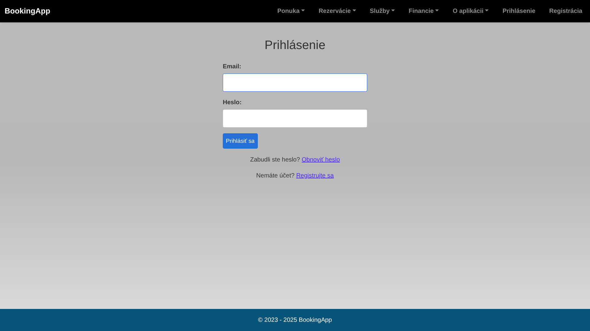
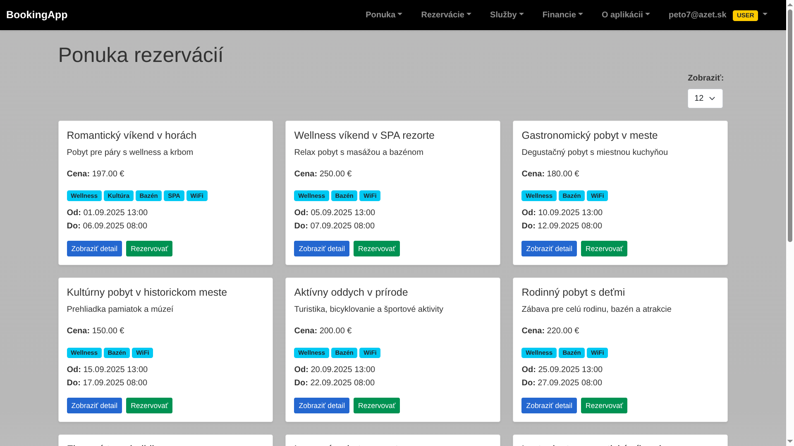
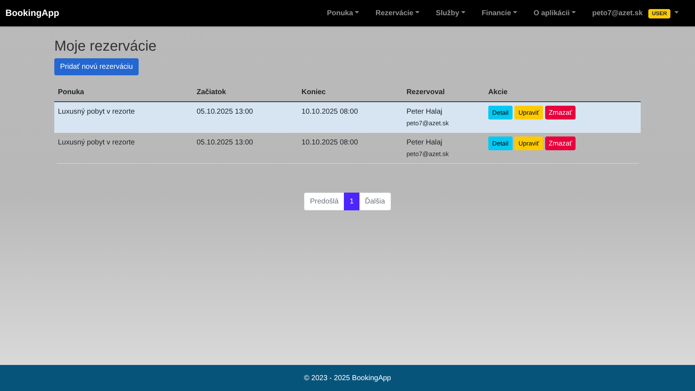

# Booking EasyApp


## 🔗 Live Demo

➡️ **Application:** [https://bookingapp.gloziksoft.sk/](https://bookingapp.gloziksoft.sk/)
➡️ **Database (pgAdmin):** [https://bookingapp.gloziksoft.sk/pgadmin/login?next=/pgadmin/](https://bookingapp.gloziksoft.sk/pgadmin/login?next=/pgadmin/)

## 🔑 Demo Credentials (for presentation)

### **Application Login**

| Role  | Email                                   | Password |
| ----- | --------------------------------------- | -------- |
| Admin | [admin@test.com](mailto:admin@test.com) | **1**    |
| User  | [user@test.com](mailto:user@test.com)   | **1**    |

### **pgAdmin Login**

| System                                                                                                                                                    | Email / Username                              | Password |
| --------------------------------------------------------------------------------------------------------------------------------------------------------- | --------------------------------------------- | -------- |
| pgAdmin                                                                                                                                                   | [peto7724@gmal.com](mailto:peto7724@gmal.com) | root     |
| ➡️ **Application:** [https://bookingapp.gloziksoft.sk/](https://bookingapp.gloziksoft.sk/)                                                                |                                               |          |
| ➡️ **Database (pgAdmin):** [https://bookingapp.gloziksoft.sk/pgadmin/login?next=/pgadmin/](https://bookingapp.gloziksoft.sk/pgadmin/login?next=/pgadmin/) |                                               |          |
| ➡️ **[https://bookingapp.gloziksoft.sk/](https://bookingapp.gloziksoft.sk/)**                                                                             |                                               |          |

## 🏗️ System Architecture


## 🗄️ Database ER Diagram


## 📡 REST API Endpoints

| Method | Endpoint               | Description           |
| ------ | ---------------------- | --------------------- |
| GET    | /api/reservations      | List all reservations |
| POST   | /api/reservations      | Create reservation    |
| PUT    | /api/reservations/{id} | Update reservation    |
| DELETE | /api/reservations/{id} | Delete reservation    |

## ☁️ Deployment (Oracle Cloud + NGINX)

* Oracle Cloud Compute Instance (Ubuntu 24.04)
* Docker Compose (Backend + PostgreSQL)
* NGINX reverse proxy
* SSL via Certbot (Let's Encrypt)

A modern full‑stack reservation management system built with **Spring Boot**, **Thymeleaf**, and **PostgreSQL**, fully containerized and deployable via **Docker**. The application provides a user-friendly interface, secure authentication, a REST API, and supports deployment to cloud environments such as **Oracle Cloud Infrastructure**.

---

## 🖼️ Preview

### Home & Login

| Home Page                  | Login Page                 |
| -------------------------- | -------------------------- |
|        |       |

### Offers – Guest / User / Admin

| Guest View                     | User View                      | Admin View                      |
| ----------------------------- | ------------------------------ | ------------------------------ |
|   |     |    |

### My Reservations

| My Reservations                |
| ------------------------------ |
|   |

Below is an example screenshot of the Booking EasyApp UI:


---

## 🧰 Technologies Used

### Backend & Core

* **Java 17**
* **Spring Boot** (Web, Security, Data JPA, Validation)
* **Thymeleaf** templates
* **PostgreSQL** (previously MariaDB)
* **Hibernate** ORM
* **Maven**

### Deployment

* **Docker & Docker Compose**
* **Oracle Cloud Ubuntu Server** (production deployment)

### Other

* Bootstrap 5
* REST API support
* File upload system

---

## 🗂️ Project Structure

```
src/
├── main/
│   ├── java/com/booking/app/                 # Application source code
│   │   ├── controllers                       # MVC + REST controllers
│   │   ├── data                              # Entities, enums, repositories
│   │   ├── models                            # DTOs, mappers, exceptions, services
│   │   └── configuration                     # Security configuration
│   └── resources/
│       ├── templates/                        # Thymeleaf HTML templates
│       ├── static/                           # CSS, JS, images
│       ├── application.properties            # Base config
│       ├── application-local.properties      # Local environment
│       └── application-prod.properties       # Production environment
└── test/                                      # Unit & integration tests
```

---

## 🛢️ Migrated to PostgreSQL

The application has been successfully migrated from **MariaDB** to **PostgreSQL**.

### Production configuration (`application-prod.properties`):

```properties
spring.datasource.url=jdbc:postgresql://db:5432/booking
spring.datasource.username=booking_user
spring.datasource.password=yourpassword
spring.jpa.database-platform=org.hibernate.dialect.PostgreSQLDialect
spring.jpa.hibernate.ddl-auto=update
spring.jpa.show-sql=true
```

### Database Initialization

The container automatically executes `db-init-scripts/init.sql` during startup.

---

## 🐳 Running the Application with Docker

### 1. Build & Start

```bash
docker-compose up --build -d
```

### 2. Services

| Service    | URL                                            |
| ---------- | ---------------------------------------------- |
| Backend    | [http://localhost:8080](http://localhost:8080) |
| PostgreSQL | localhost:5432                                 |

### 3. Stopping

```bash
docker-compose down
```

---

## 🚀 Running the Project Locally

### Requirements

* Java 17+
* Maven
* PostgreSQL (or use Docker)

### Run locally:

```bash
./mvnw spring-boot:run
```

The app runs on: **[http://localhost:8080](http://localhost:8080)**

---

## 📌 Features

* User registration & login
* Offer management (create/edit/delete)
* Reservation module
* REST API: `/api/reservations`
* File upload & storage service
* Email notifications support
* Custom error pages (404, 500, ...)
* Admin features for managing data

---

## 🔐 Security

* Spring Security (session-based authentication)
* Protected routes & role-based restrictions
* Secure password hashing

---

## 🧪 Testing

The project includes unit and integration tests.

```bash
./mvnw test
```

---

## 💾 Database Backups

Database dumps are stored in:

```
backup/
```

Example:

```
backup/booking_app_20250924_091616.sql
```

---

## 🌐 Deployment on Oracle Cloud

* Ubuntu 24.04 LTS
* Docker + Docker Compose
* Reverse proxy ready (NGINX optional)
* SSH access configured for secure remote management

---

## 📋 Future Improvements

* Multi-language UI (SK / EN)
* Advanced role management
* More complex reporting & statistics
* React or Vue frontend

---

## 🧑‍💻 Author

**Peter Glozik**
LinkedIn: [https://www.linkedin.com/in/peter-gl%C3%B3zik-a7292b272](https://www.linkedin.com/in/peter-gl%C3%B3zik-a7292b272)

---

## 📝 License

MIT License

---

# 🇸🇰 Booking EasyApp (Slovenská verzia)


## 🔗 Live Demo

➡️ **[https://bookingapp.gloziksoft.sk/](https://bookingapp.gloziksoft.sk/)**

## 📝 Popis aplikácie

Booking EasyApp je moderná webová aplikácia určená na správu rezervácií, ponúk, používateľov a súborov. Beží na frameworku **Spring Boot**, využíva **PostgreSQL**, **Thymeleaf** a je plne kontajnerizovaná cez **Docker**, s produkčným nasadením cez **Oracle Cloud + NGINX**.

---

## 🧰 Použité technológie

* Java 17
* Spring Boot (Web, Security, Data JPA)
* Thymeleaf
* PostgreSQL
* Hibernate ORM
* Docker & Docker Compose
* NGINX reverse proxy
* Bootstrap 5

---

## 🗂️ Štruktúra projektu

```
src/
├── main/
│   ├── java/com/booking/app/                 # Zdrojový kód
│   │   ├── controllers                       # Web a REST kontroléry
│   │   ├── data                              # Entity, enumy, repozitáre
│   │   ├── models                            # DTO, výnimky, mapre, služby
│   │   └── configuration                     # Bezpečnosť
│   └── resources/
│       ├── templates/                        # HTML šablóny (Thymeleaf)
│       ├── static/                           # CSS, JS, obrázky
│       ├── application.properties            # Hlavná konfigurácia
│       ├── application-local.properties      # Lokálne prostredie
│       └── application-prod.properties       # Produkčné prostredie
└── test/                                      # Unit a integračné testy
```

---

## 🏗️ Architektúra systému


## 🗄️ Databázový ER diagram


---

## 📸 Náhľady aplikácie

### Home & Login

| Home Page                  | Login Page                 |
| -------------------------- | -------------------------- |
|        |       |

### Offers – Guest / User / Admin

| Guest View                     | User View                      | Admin View                      |
| ----------------------------- | ------------------------------ | ------------------------------ |
|   |     |    |

### My Reservations

| My Reservations                |
| ------------------------------ |
|   |

Below is an example screenshot of the Booking EasyApp UI:


---

## 📡 REST API (prehľad)

| Metóda | Endpoint               | Popis                 |
| ------ | ---------------------- | --------------------- |
| GET    | /api/reservations      | Zoznam rezervácií     |
| POST   | /api/reservations      | Vytvorenie rezervácie |
| PUT    | /api/reservations/{id} | Úprava rezervácie     |
| DELETE | /api/reservations/{id} | Zmazanie rezervácie   |

---

## ☁️ Produkčné nasadenie (Oracle Cloud + NGINX)

* Oracle Cloud Compute Instance (Ubuntu 24.04)
* Docker Compose: Backend + PostgreSQL
* Reverzný proxy server NGINX
* SSL certifikáty pomocou Certbot (Let's Encrypt)

---

## 📌 Funkcionality

* Registrácia a prihlásenie používateľov
* Tvorba, úprava a mazanie ponúk
* Rezervačný systém
* Správa súborov a obrázkov
* REST API endpointy
* Vlastné chybové stránky
* Admin rozhranie

---

## 🧪 Testovanie

```bash
./mvnw test
```

---

## 💾 Zálohy databázy

Zálohy sú uložené v priečinku:

```
backup/
```

---

## 🧑‍💻 Autor

**Peter Glozik**
LinkedIn: [https://www.linkedin.com/in/peter-gl%C3%B3zik-a7292b272](https://www.linkedin.com/in/peter-gl%C3%B3zik-a7292b272)

---
Md
---

## 🚀 Deployment & Runtime Guide

This project uses **Docker Compose** with a clear separation between
**application runtime** and **monitoring infrastructure**.

The repository is the **single source of truth**.
The VM is only a runtime environment.

---

## 🧱 Architecture Overview

Two independent Docker Compose stacks are used:

| Stack | Compose file | Purpose |
|-----|-------------|--------|
| Application | `docker-compose.app.yml` | Spring Boot app, PostgreSQL, pgAdmin |
| Monitoring | `docker-compose.monitoring.yml` | Prometheus, Grafana, cAdvisor |

Both stacks share a single Docker network (`booking_network`).

---

## ⚙️ Prerequisites (VM)

The target VM must have:

- Docker
- Docker Compose (plugin)
- Git
- Open ports (example):
  - `8080` – Booking App
  - `3000` – Grafana
  - `9090` – Prometheus

Clone the repository on the VM:

```bash
git clone https://github.com/Gloziksoft/Booking_EasyApp /opt/booking-easyapp
cd /opt/booking-easyapp
🔐 Environment Configuration
Create a .env file from the template:
Copy code
Bash
cp .env.example .env
nano .env
Example variables:
Copy code
Env
POSTGRES_PORT=5433
POSTGRES_USER=postgres
POSTGRES_PASSWORD=secret
POSTGRES_DB=booking_app

PGADMIN_DEFAULT_EMAIL=admin@example.com
PGADMIN_DEFAULT_PASSWORD=secret

SPRING_PROFILES_ACTIVE=prod

GRAFANA_ADMIN_USER=admin
GRAFANA_ADMIN_PASSWORD=admin

PROMETHEUS_IMAGE=prom/prometheus:v2.52.0
PROMETHEUS_PORT=9090
⚠️ Never commit the real .env file – only .env.example.
🧩 Application Stack (Booking App)
Start / Update application stack
Copy code
Bash
docker compose -p booking -f docker-compose.app.yml pull
docker compose -p booking -f docker-compose.app.yml up -d
Stop application stack
Copy code
Bash
docker compose -p booking -f docker-compose.app.yml down
Services started:
Spring Boot Booking App
PostgreSQL
pgAdmin
📊 Monitoring Stack
Start / Update monitoring stack
Copy code
Bash
docker compose -p monitoring -f docker-compose.monitoring.yml pull
docker compose -p monitoring -f docker-compose.monitoring.yml up -d
Stop monitoring stack
Copy code
Bash
docker compose -p monitoring -f docker-compose.monitoring.yml down
Services started:
Prometheus
Grafana
cAdvisor
📈 Prometheus Configuration
Located at:
Copy code

monitoring/prometheus.yml
Final production configuration:
Copy code
Yaml
global:
  scrape_interval: 15s
  evaluation_interval: 15s

scrape_configs:

  - job_name: 'booking-app'
    metrics_path: /actuator/prometheus
    static_configs:
      - targets:
          - app:8080

  - job_name: 'booking-cadvisor'
    static_configs:
      - targets:
          - cadvisor:8080

  - job_name: 'insurance-app'
    metrics_path: /actuator/prometheus
    static_configs:
      - targets:
          - <INSURANCE_VM_IP>:8080

  - job_name: 'insurance-cadvisor'
    static_configs:
      - targets:
          - <INSURANCE_VM_IP>:8082
Replace <INSURANCE_VM_IP> with the real IP of the insurance VM.
✅ Verification
Prometheus targets UI:
Copy code

http://<VM_IP>:9090/targets
Expected status:
🟢 booking-app
🟢 booking-cadvisor
🟢 insurance-app
🟢 insurance-cadvisor
Grafana UI:
Copy code

http://<VM_IP>:3000
Login using credentials from .env.
🔄 CI/CD Flow (Production)
Code or config change
git commit + git push
GitHub Actions:
build JAR
build Docker image
push to GHCR
VM pulls new image via Docker Compose
Containers are recreated automatically
No manual VM changes are required.
🧹 Cleanup & Rebuild
Stop stacks (keeps data):
Copy code
Bash
docker compose -p booking -f docker-compose.app.yml down
docker compose -p monitoring -f docker-compose.monitoring.yml down
⚠️ Full wipe (deletes DB and Grafana data):
Copy code
Bash
docker compose -p booking -f docker-compose.app.yml down --volumes
docker compose -p monitoring -f docker-compose.monitoring.yml down --volumes
🧠 Key Principles
Repository = single source of truth
No manual edits on VM
Docker Compose files are declarative
Monitoring runs independently from the app
Easy rebuild from zero
This setup is designed as a production-ready demo project showing CI/CD, Docker, monitoring, and infrastructure skills.
Copy code

---

## ✅ ČO TERAZ UROB

Na lokále:

```bash
git checkout main
nano README.md   # alebo VS Code
➡️ vlož sekciu na koniec súboru
Potom:
Copy code
Bash
git add README.md
git commit -m "docs: add production deployment and monitoring guide"
git push origin main
🧠 ZÁVER
Týmto máš:
plnohodnotný runbook
jasný infra contract
README, ktoré funguje aj pri wipe VM
a dokumentáciu, ktorá vyzerá výborne na pohovore
Ak chceš ďalší krok:
infra diagram (PNG + mermaid)
Alertmanager
Grafana dashboard import
alebo hardening checklist

## 📝 Licencia

MIT License
