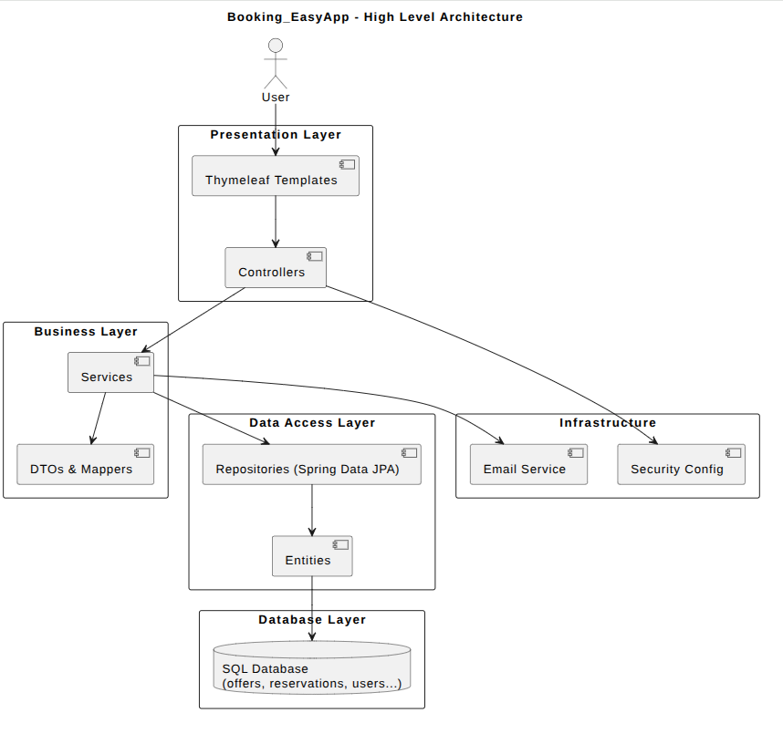
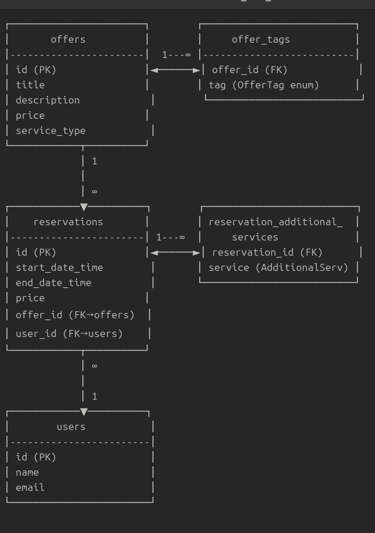
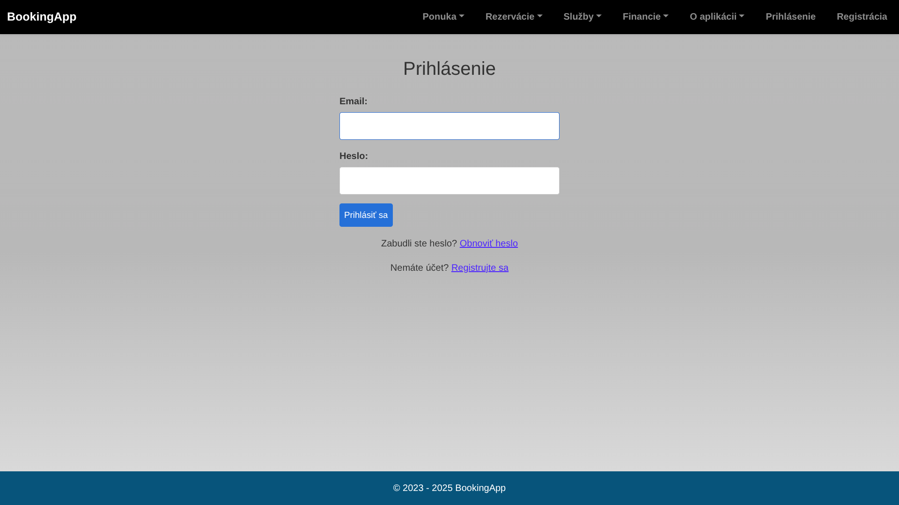
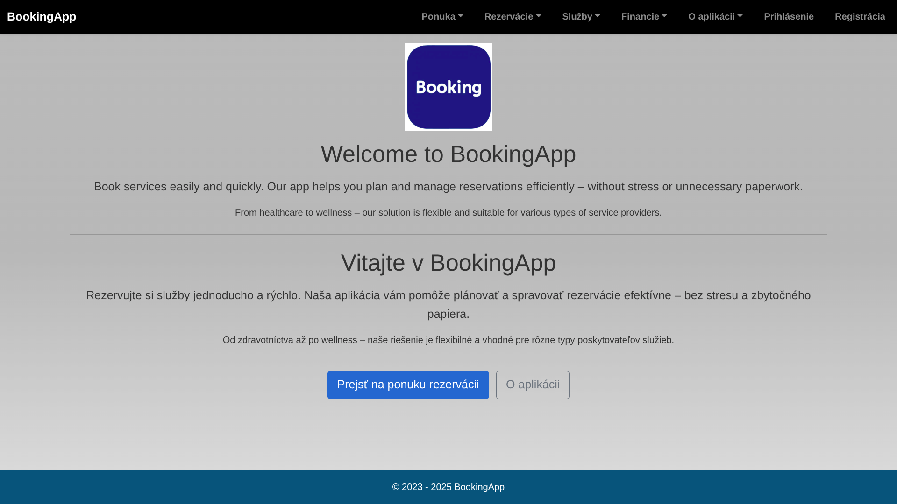
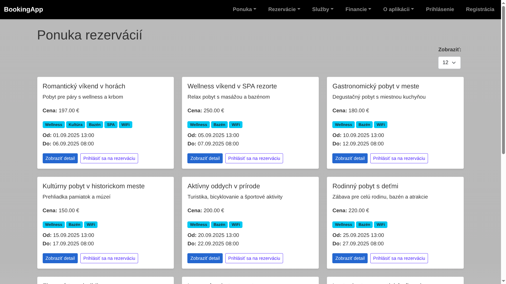
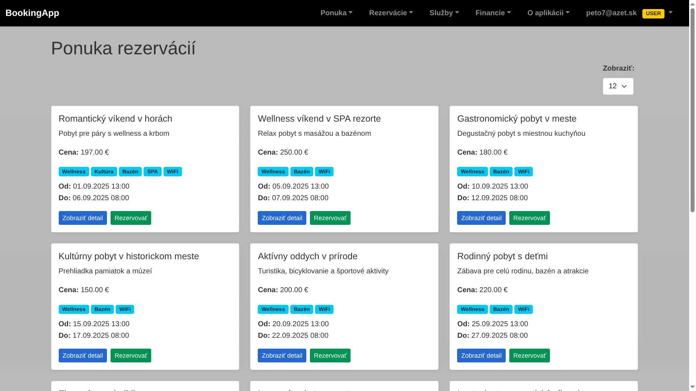
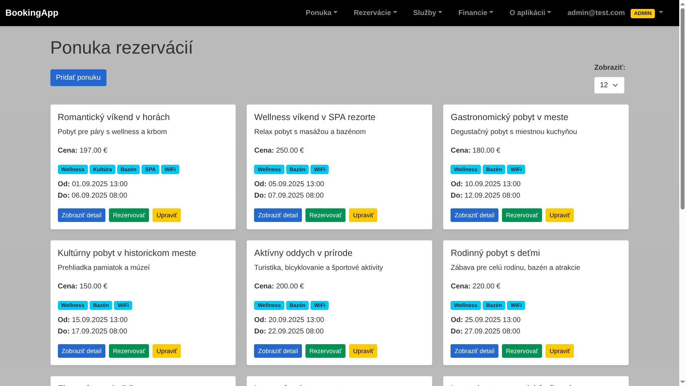
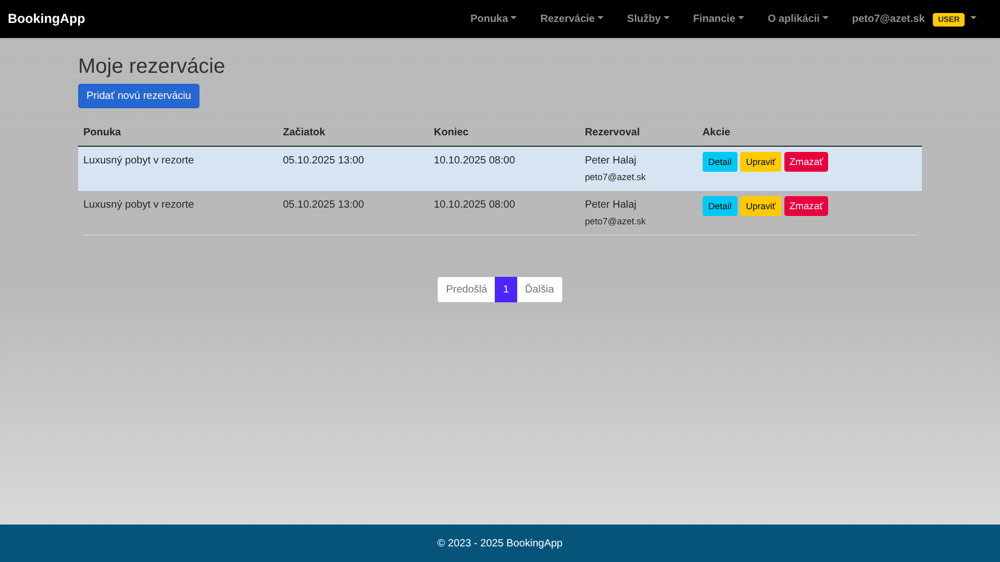

# Booking EasyApp


## 🔗 Live Demo

➡️ **Application:** [https://bookingapp.gloziksoft.sk/](https://bookingapp.gloziksoft.sk/)
➡️ **Database (pgAdmin):** [https://bookingapp.gloziksoft.sk/pgadmin/login?next=/pgadmin/](https://bookingapp.gloziksoft.sk/pgadmin/login?next=/pgadmin/)

## 🔑 Demo Credentials (for presentation)

### **Application Login**

| Role  | Email                                   | Password |
| ----- | --------------------------------------- | -------- |
| Admin | [admin@test.com](mailto:admin@test.com) | **1**    |
| User  | [user@test.com](mailto:user@test.com)   | **1**    |

### **pgAdmin Login**

| System                                                                                                                                                    | Email / Username                              | Password |
| --------------------------------------------------------------------------------------------------------------------------------------------------------- | --------------------------------------------- | -------- |
| pgAdmin                                                                                                                                                   | [peto7724@gmal.com](mailto:peto7724@gmal.com) | root     |
| ➡️ **Application:** [https://bookingapp.gloziksoft.sk/](https://bookingapp.gloziksoft.sk/)                                                                |                                               |          |
| ➡️ **Database (pgAdmin):** [https://bookingapp.gloziksoft.sk/pgadmin/login?next=/pgadmin/](https://bookingapp.gloziksoft.sk/pgadmin/login?next=/pgadmin/) |                                               |          |
| ➡️ **[https://bookingapp.gloziksoft.sk/](https://bookingapp.gloziksoft.sk/)**                                                                             |                                               |          |

## 🏗️ System Architecture



## 🗄️ Database ER Diagram



## 📡 REST API Endpoints

| Method | Endpoint               | Description           |
| ------ | ---------------------- | --------------------- |
| GET    | /api/reservations      | List all reservations |
| POST   | /api/reservations      | Create reservation    |
| PUT    | /api/reservations/{id} | Update reservation    |
| DELETE | /api/reservations/{id} | Delete reservation    |

## ☁️ Deployment (Oracle Cloud + NGINX)

* Oracle Cloud Compute Instance (Ubuntu 24.04)
* Docker Compose (Backend + PostgreSQL)
* NGINX reverse proxy
* SSL via Certbot (Let's Encrypt)

A modern full‑stack reservation management system built with **Spring Boot**, **Thymeleaf**, and **PostgreSQL**, fully containerized and deployable via **Docker**. The application provides a user-friendly interface, secure authentication, a REST API, and supports deployment to cloud environments such as **Oracle Cloud Infrastructure**.

---

## 🖼️ Preview

### Home & Login

| Home Page                                           | Login Page                                          |
| --------------------------------------------------- | --------------------------------------------------- |
|  |  |

### Offers – Guest / User / Admin

| Guest View                                          | User View                                           | Admin View                                          |
| --------------------------------------------------- | --------------------------------------------------- | --------------------------------------------------- |
|  |  |  |

### My Reservations

| My Reservations                                     |
| --------------------------------------------------- |
|  |

Below is an example screenshot of the Booking EasyApp UI:


---

## 🧰 Technologies Used

### Backend & Core

* **Java 17**
* **Spring Boot** (Web, Security, Data JPA, Validation)
* **Thymeleaf** templates
* **PostgreSQL** (previously MariaDB)
* **Hibernate** ORM
* **Maven**

### Deployment

* **Docker & Docker Compose**
* **Oracle Cloud Ubuntu Server** (production deployment)

### Other

* Bootstrap 5
* REST API support
* File upload system

---

## 🗂️ Project Structure

```
src/
├── main/
│   ├── java/com/booking/app/                 # Application source code
│   │   ├── controllers                       # MVC + REST controllers
│   │   ├── data                              # Entities, enums, repositories
│   │   ├── models                            # DTOs, mappers, exceptions, services
│   │   └── configuration                     # Security configuration
│   └── resources/
│       ├── templates/                        # Thymeleaf HTML templates
│       ├── static/                           # CSS, JS, images
│       ├── application.properties            # Base config
│       ├── application-local.properties      # Local environment
│       └── application-prod.properties       # Production environment
└── test/                                      # Unit & integration tests
```

---

## 🛢️ Migrated to PostgreSQL

The application has been successfully migrated from **MariaDB** to **PostgreSQL**.

### Production configuration (`application-prod.properties`):

```properties
spring.datasource.url=jdbc:postgresql://db:5432/booking
spring.datasource.username=booking_user
spring.datasource.password=yourpassword
spring.jpa.database-platform=org.hibernate.dialect.PostgreSQLDialect
spring.jpa.hibernate.ddl-auto=update
spring.jpa.show-sql=true
```

### Database Initialization

The container automatically executes `db-init-scripts/init.sql` during startup.

---

## 🐳 Running the Application with Docker

### 1. Build & Start

```bash
docker-compose up --build -d
```

### 2. Services

| Service    | URL                                            |
| ---------- | ---------------------------------------------- |
| Backend    | [http://localhost:8080](http://localhost:8080) |
| PostgreSQL | localhost:5432                                 |

### 3. Stopping

```bash
docker-compose down
```

---

## 🚀 Running the Project Locally

### Requirements

* Java 17+
* Maven
* PostgreSQL (or use Docker)

### Run locally:

```bash
./mvnw spring-boot:run
```

The app runs on: **[http://localhost:8080](http://localhost:8080)**

---

## 📌 Features

* User registration & login
* Offer management (create/edit/delete)
* Reservation module
* REST API: `/api/reservations`
* File upload & storage service
* Email notifications support
* Custom error pages (404, 500, ...)
* Admin features for managing data

---

## 🔐 Security

* Spring Security (session-based authentication)
* Protected routes & role-based restrictions
* Secure password hashing

---

## 🧪 Testing

The project includes unit and integration tests.

```bash
./mvnw test
```

---

## 💾 Database Backups

Database dumps are stored in:

```
backup/
```

Example:

```
backup/booking_app_20250924_091616.sql
```

---

## 🌐 Deployment on Oracle Cloud

* Ubuntu 24.04 LTS
* Docker + Docker Compose
* Reverse proxy ready (NGINX optional)
* SSH access configured for secure remote management

---

## 📋 Future Improvements

* Multi-language UI (SK / EN)
* Advanced role management
* More complex reporting & statistics
* React or Vue frontend

---

## 🧑‍💻 Author

**Peter Glozik**
LinkedIn: [https://www.linkedin.com/in/peter-gl%C3%B3zik-a7292b272](https://www.linkedin.com/in/peter-gl%C3%B3zik-a7292b272)

---

## 📝 License

MIT License

---

# 🇸🇰 Booking EasyApp (Slovenská verzia)


## 🔗 Live Demo

➡️ **[https://bookingapp.gloziksoft.sk/](https://bookingapp.gloziksoft.sk/)**

## 📝 Popis aplikácie

Booking EasyApp je moderná webová aplikácia určená na správu rezervácií, ponúk, používateľov a súborov. Beží na frameworku **Spring Boot**, využíva **PostgreSQL**, **Thymeleaf** a je plne kontajnerizovaná cez **Docker**, s produkčným nasadením cez **Oracle Cloud + NGINX**.

---

## 🧰 Použité technológie

* Java 17
* Spring Boot (Web, Security, Data JPA)
* Thymeleaf
* PostgreSQL
* Hibernate ORM
* Docker & Docker Compose
* NGINX reverse proxy
* Bootstrap 5

---

## 🗂️ Štruktúra projektu

```
src/
├── main/
│   ├── java/com/booking/app/                 # Zdrojový kód
│   │   ├── controllers                       # Web a REST kontroléry
│   │   ├── data                              # Entity, enumy, repozitáre
│   │   ├── models                            # DTO, výnimky, mapre, služby
│   │   └── configuration                     # Bezpečnosť
│   └── resources/
│       ├── templates/                        # HTML šablóny (Thymeleaf)
│       ├── static/                           # CSS, JS, obrázky
│       ├── application.properties            # Hlavná konfigurácia
│       ├── application-local.properties      # Lokálne prostredie
│       └── application-prod.properties       # Produkčné prostredie
└── test/                                      # Unit a integračné testy
```

---

## 🏗️ Architektúra systému


## 🗄️ Databázový ER diagram


---

## 📸 Náhľady aplikácie

### Home & Login

| Domovská stránka                                    | Prihlásenie                                         |
| --------------------------------------------------- | --------------------------------------------------- |
|  |  |

### Ponuky – Návštevník / Používateľ / Admin

| Návštevník                                          | Používateľ                                          | Admin                                               |
| --------------------------------------------------- | --------------------------------------------------- | --------------------------------------------------- |
|  |  |  |

### Rezervácie

| Moje rezervácie                                     |
| --------------------------------------------------- |
|  |

---

## 📡 REST API (prehľad)

| Metóda | Endpoint               | Popis                 |
| ------ | ---------------------- | --------------------- |
| GET    | /api/reservations      | Zoznam rezervácií     |
| POST   | /api/reservations      | Vytvorenie rezervácie |
| PUT    | /api/reservations/{id} | Úprava rezervácie     |
| DELETE | /api/reservations/{id} | Zmazanie rezervácie   |

---

## ☁️ Produkčné nasadenie (Oracle Cloud + NGINX)

* Oracle Cloud Compute Instance (Ubuntu 24.04)
* Docker Compose: Backend + PostgreSQL
* Reverzný proxy server NGINX
* SSL certifikáty pomocou Certbot (Let's Encrypt)

---

## 📌 Funkcionality

* Registrácia a prihlásenie používateľov
* Tvorba, úprava a mazanie ponúk
* Rezervačný systém
* Správa súborov a obrázkov
* REST API endpointy
* Vlastné chybové stránky
* Admin rozhranie

---

## 🧪 Testovanie

```bash
./mvnw test
```

---

## 💾 Zálohy databázy

Zálohy sú uložené v priečinku:

```
backup/
```

---

## 🧑‍💻 Autor

**Peter Glozik**
LinkedIn: [https://www.linkedin.com/in/peter-gl%C3%B3zik-a7292b272](https://www.linkedin.com/in/peter-gl%C3%B3zik-a7292b272)

---

## 📝 Licencia

MIT License

